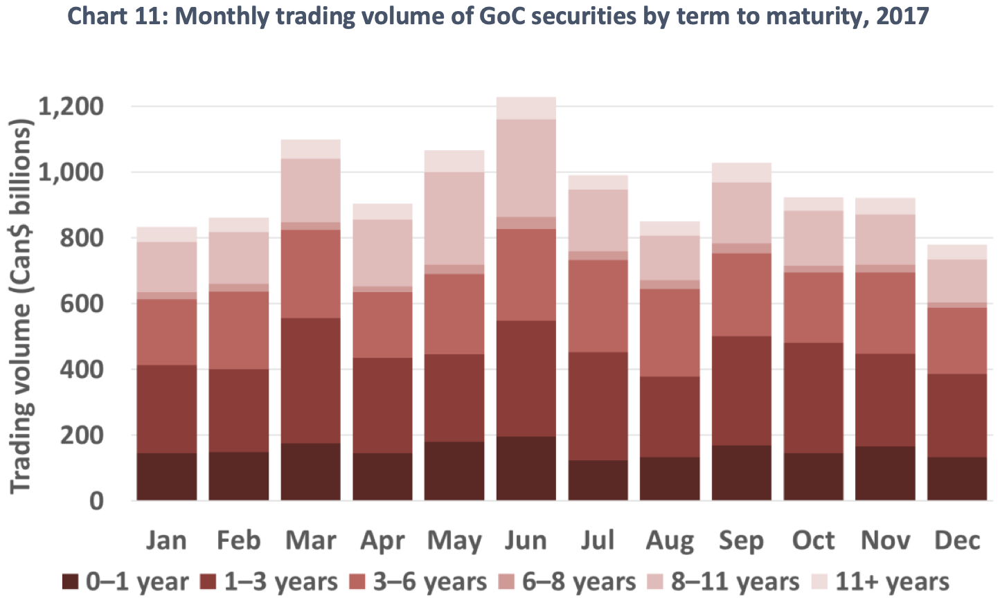

##### Download

+ [Paper](https://www.bankofcanada.ca/2018/09/staff-discussion-paper-2018-10/)
<!--
+ [Presentation](presentation)
+ [Online appendix](appendix1.pdf)
+ [Code and data](https://github.com/pmichaillat/feru)
-->

---

##### Abstract

This discussion paper is the third in the Financial Markets Department’s series on the structure of Canadian financial markets. These papers are called “ecologies” because they study the interactions among market participants, infrastructures, regulations and the terms of the traded contract itself. In this ecology, we discuss the Government of Canada’s domestic fixed-income market. We begin with an overview of Government of Canada securities and their characteristics. We then outline common market practices and the typical participants in the market. We provide high-level statistics on activity in the market and describe the market infrastructures that support trading. Finally, we discuss risks in these securities markets.

---

##### Chart 11: Monthly trading volume of Government of Canada bonds by tenor



---

##### Citation

Berger-Soucy, L., Garriott, C., & Usche, A. (2018). Government of Canada fixed-income market ecology (No. 2018-10). *Bank of Canada Staff Discussion Paper*.

```latex
@techreport{berger2018government,
  title={Government of Canada fixed-income market ecology},
  author={Berger-Soucy, L{\'e}anne and Garriott, Corey and Usche, Andr{\'e}},
  year={2018},
  journal={Bank of Canada Staff Discussion Paper}
}}
```

---

<!--
##### Related material

+ [Presentation slides](presentation1.pdf)
+ [Summary of the paper](https://www.penguinrandomhouse.com/books/110403/unusual-uses-for-olive-oil-by-alexander-mccall-smith/)
-->
