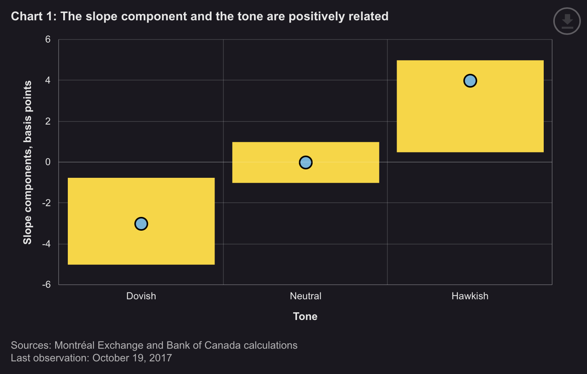

##### Download

+ [Paper](https://www.bankofcanada.ca/2018/09/staff-discussion-paper-2018-10/)
<!--
+ [Presentation](presentation)
+ [Online appendix](appendix1.pdf)
+ [Code and data](https://github.com/pmichaillat/feru)
-->

---

##### Abstract

The tone of Canadian monetary policy statements has an impact on the Canadian dollar and long-term Government of Canada bonds. In our sample period from 2006 to 2016, we measure their response in the 60 minutes following these announcements. We find that an unanticipated change in the tone of statements can affect the dollar by as much as 0.5 of a cent. This is a sizable impact considering that an unexpected rate hike (or cut) of 25 basis points (bps) can initially affect the dollar by an average of 1.25 cents. The tone can also initially move the 10-year Government of Canada bond by 2 bps, which again is considerable given that an unexpected rate hike (or cut) can move it by 7 bps.

---

##### Chart 1: The tone of the policy statement moves the slope of the yield curve



---

##### Citation

Feunou, B., Garriott, C., Kyeong, J., & Leiderman, R. (2017). The Impacts of Monetary Policy Statements (No. 2017-22). *Bank of Canada Staff Analytical Notes*.

```latex
@techreport{feunou2017impacts,
  title={The Impacts of Monetary Policy Statements},
  author={Feunou, Bruno and Garriott, Corey and Kyeong, James and Leiderman, Raisa},
  year={2017},
  journal={Bank of Canada Staff Analytical Notes}
}
```

---

<!--
##### Related material

+ [Presentation slides](presentation1.pdf)
+ [Summary of the paper](https://www.penguinrandomhouse.com/books/110403/unusual-uses-for-olive-oil-by-alexander-mccall-smith/)
-->
