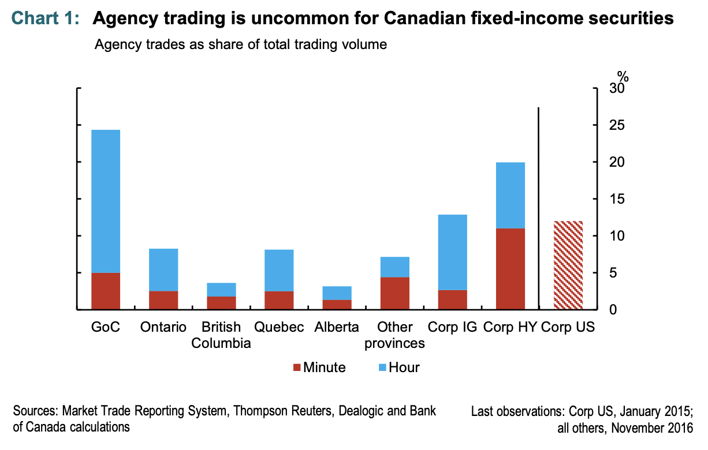

##### Download

+ [Paper](https://www.bankofcanada.ca/2017/09/staff-analytical-note-2017-11/)
<!--
+ [Presentation](presentation)
+ [Online appendix](appendix1.pdf)
+ [Code and data](https://github.com/pmichaillat/feru)
-->

---

##### Abstract

The note uses Market Trade Reporting System (MTRS 2.0) data from June–November 2016 for all dealer‑reported bond trades in GoC, provincial, and corporate debt. Because trades are not tagged as “principal” or “agent,” the authors infer agency trading by looking for offsetting trades: if a dealer reverses a position in the same security within 1 minute, that volume is treated as agency; if it is not offset, it is treated as principal. Across major fixed‑income segments, 1‑minute agency shares are low: roughly 1–5% of volume for provincial bonds, somewhat higher for GoCs, and about 11% for high‑yield corporates; even using a 1‑hour window, agency shares only reach 4–25% depending on issuer and liquidity.

---

##### Chart 1: The tone of the policy statement moves the slope of the yield curve



---

##### Citation

Hyun, D., Johal, J., & Garriott, C. (2017). Do Canadian Broker-Dealers Act as Agents or Principals in Bond Trading? (No. 2017-11). *Bank of Canada Staff Analytical Notes*.

```latex
@techreport{hyun2017canadian,
  title={Do Canadian Broker-Dealers Act as Agents or Principals in Bond Trading?},
  author={Hyun, Daniel and Johal, Jesse and Garriott, Corey},
  year={2017},
  journal={Bank of Canada Staff Analytical Notes}
}
```

---

<!--
##### Related material

+ [Presentation slides](presentation1.pdf)
+ [Summary of the paper](https://www.penguinrandomhouse.com/books/110403/unusual-uses-for-olive-oil-by-alexander-mccall-smith/)
-->
