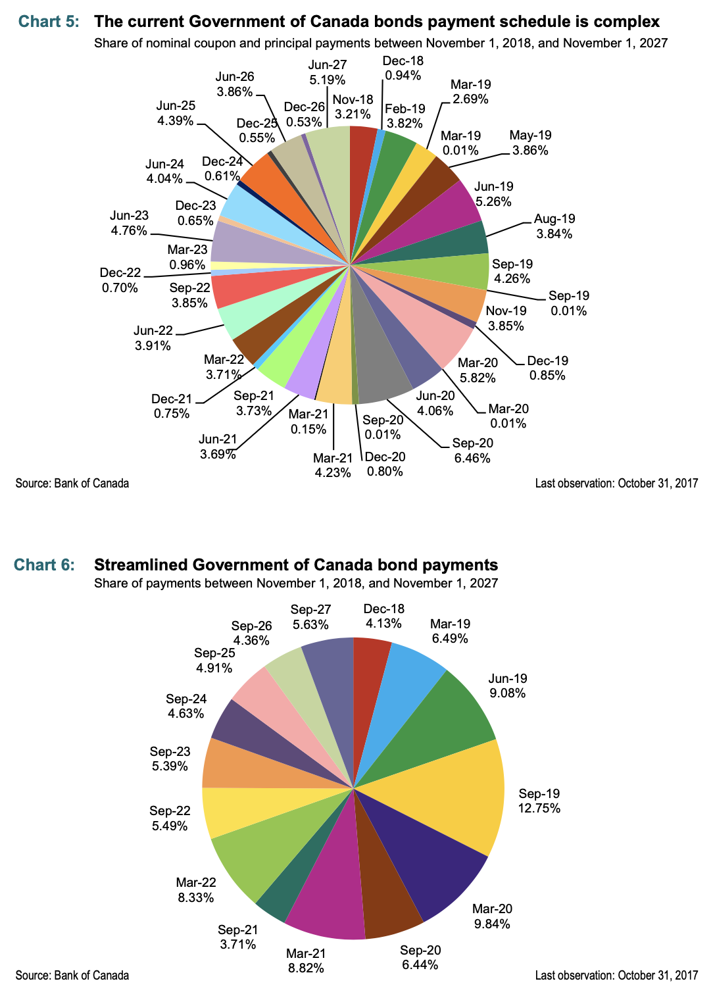

##### Download

+ [Paper](https://www.bankofcanada.ca/2018/12/staff-discussion-paper-2018-15/)
<!--
+ [Presentation](presentation)
+ [Online appendix](appendix1.pdf)
+ [Code and data](https://github.com/pmichaillat/feru)
-->

---

##### Abstract

This paper presents four blue-sky ideas for lowering the cost of the Government of Canada’s debt without increasing the debt’s risk profile. We argue that each idea would improve the secondary-market liquidity of government debt, thereby increasing the demand for government bonds and thus lowering their cost at issuance. The first two ideas would improve liquidity by enhancing the active management of the government’s debt through market operations used to support the liquidity of outstanding bonds. The second two ideas would simplify the set of securities issued by the government, concentrating issuance in a smaller set of bonds that would each be more highly traded. We discuss the ideas and give an account of the political, legal and operational impediments.

---

##### Charts 5 and 6: Reducing the complex series of payments out of the debt management office



---

##### Citation

 Garriott, C., Lefebvre, S., Nolin, G., Rivadeneyra, F., & Walton, A. (2020). Alternative futures for Government of Canada debt management. *Journal of Financial Economic Policy*, 12(4), 659-685.

```latex
@article{garriott2020alternative,
  title={Alternative futures for Government of Canada debt management},
  author={Garriott, Corey and Lefebvre, Sophie and Nolin, Guillaume and Rivadeneyra, Francisco and Walton, Adrian},
  journal={Journal of Financial Economic Policy},
  volume={12},
  number={4},
  pages={659--685},
  year={2020},
  publisher={Emerald Publishing Limited}
}
```

---

<!--
##### Related material

+ [Presentation slides](presentation1.pdf)
+ [Summary of the paper](https://www.penguinrandomhouse.com/books/110403/unusual-uses-for-olive-oil-by-alexander-mccall-smith/)
-->
