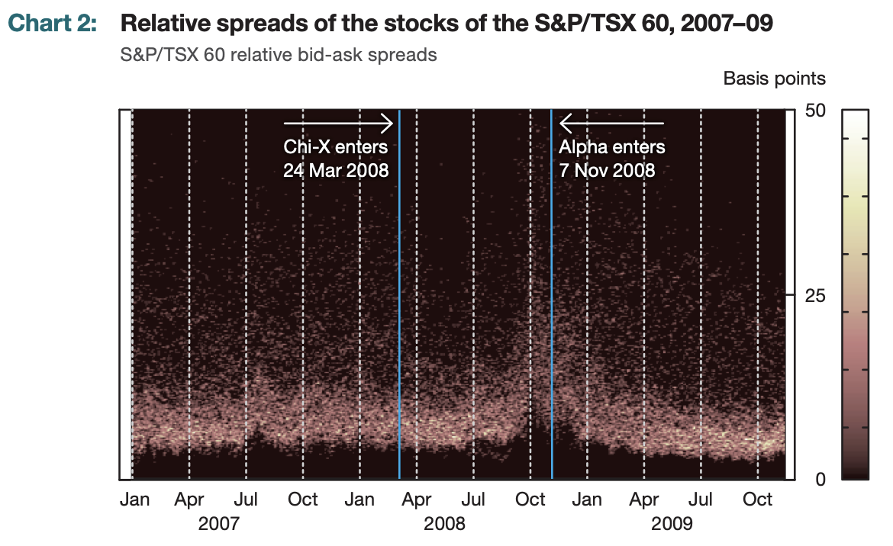

##### Download

+ [Paper](https://www.banqueducanada.ca/wp-content/uploads/2013/11/boc-review-autumn13-garriott.pdf)
<!--
+ [Presentation](presentation)
+ [Online appendix](appendix1.pdf)
+ [Code and data](https://github.com/pmichaillat/feru)
-->

---

##### Abstract

Historically the TSX was a near 'natural monopoly,' benefiting from economies of scale and liquidity externalities, so all trading concentrated there. From the 1980s onward, cheap computing, electronic matching, smart‑order routers, and a 2001 ATS regulatory framework lowered entry barriers and made it feasible to run multiple venues while virtually consolidating quotes on a screen. Competition forced a large cut in explicit trading fees: TSX per‑trade charges fell by almost 80% from 2006 to 2010, and new fee models (maker‑taker, discounted rates for electronic liquidity providers) emerged. Venues introduced new order types and dark functionality, allowing large or conditional orders to be executed with less information leakage; early empirical work suggests Canadian dark trading has so far been consistent with good liquidity and price efficiency.


---

##### Charts 2: Heat map of stock-market liquidity in Canada during the event periods



---

##### Citation

Garriott, C., Pomeranets, A., Slive, J., & Thorn, T. (2013). fragmentation in Canadian equity Markets. *Bank of Canada Review*, 2013(Autumn), 20-29.

```latex
@article{garriott2013fragmentation,
  title={fragmentation in Canadian equity Markets},
  author={Garriott, Corey and Pomeranets, Anna and Slive, Joshua and Thorn, Thomas},
  journal={Bank of Canada Review},
  volume={2013},
  number={Autumn},
  pages={20--29},
  year={2013},
  publisher={Bank of Canada}
}
```

---

<!--
##### Related material

+ [Presentation slides](presentation1.pdf)
+ [Summary of the paper](https://www.penguinrandomhouse.com/books/110403/unusual-uses-for-olive-oil-by-alexander-mccall-smith/)
-->
