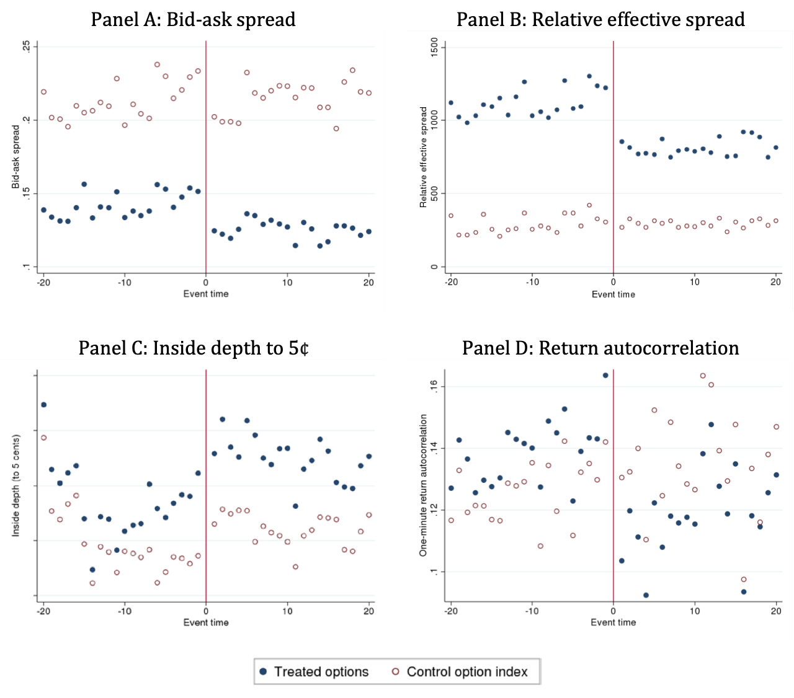

##### Download

+ [Paper](https://www.bankofcanada.ca/2016/12/staff-working-paper-2016-57/)
<!--
+ [Presentation](presentation)
+ [Online appendix](appendix1.pdf)
+ [Code and data](https://github.com/pmichaillat/feru)
-->

---

##### Abstract

We document the outcome of an options decimalization pilot on Canada’s derivatives exchange. Decimalization improves measures of liquidity and price efficiency. The impact differs by the moneyness of an option and is greatest for out-of-the-money options. In contrast with equity studies, decimalization improved depth near the best prices and improved liquidity for larger trades. We conclude with advice on decimalizing options: options that benefit most have underlying volatility less than 40, underlying equity bid-ask spread less than 50 basis points, at least one trade a day, and a distribution of depth skewed toward marketable prices.


---

##### Figure 2: Effects on options liquidity in event time around successive decimalizations



---

##### Citation

Chin, F., & Garriott, C. (2017). Options Decimalization. *Journal of Derivatives*, 25(1).

```latex
@article{chin2017options,
  title={Options Decimalization},
  author={Chin, Faith and Garriott, Corey},
  journal={Journal of Derivatives},
  volume={25},
  number={1},
  year={2017}
}
```

---

<!--
##### Related material

+ [Presentation slides](presentation1.pdf)
+ [Summary of the paper](https://www.penguinrandomhouse.com/books/110403/unusual-uses-for-olive-oil-by-alexander-mccall-smith/)
-->
