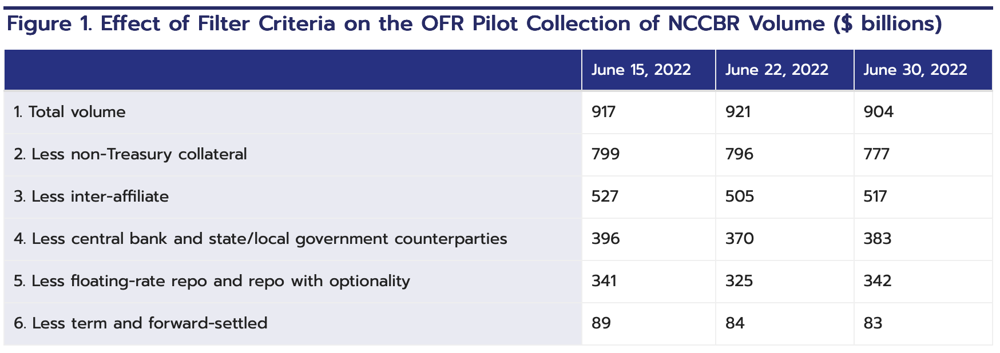

##### Download

+ [Paper](https://www.financialresearch.gov/the-ofr-blog/2025/04/22/how-the-treasury-clearing-rule-for-repo-might-affect-sofr/)
<!--
+ [Presentation](presentation)
+ [Online appendix](appendix1.pdf)
+ [Code and data](https://github.com/pmichaillat/feru)
-->

---

##### Abstract

The SEC’s upcoming central‑clearing mandate for U.S. Treasury‑backed bilateral repos could change the values of the Secured Overnight Financing Rate (SOFR). Using OFR’s 2022 pilot data on non‑centrally cleared bilateral repo (NCCBR), the authors apply the SEC’s eligibility filters and the Federal Reserve Bank of New York’s SOFR methodology, finding that only about 9 percent of pilot NCCBR volume would both be moved into clearing and qualified for inclusion in SOFR. On the three June 2022 dates studied, adding this volume leaves the SOFR median unchanged and shifts core percentiles by at most 1 basis point, but it noticeably alters the extremes of the rate distribution—by up to 55 basis points at the 1st percentile and 8 basis points at the 99th—suggesting slightly greater tail volatility even if the benchmark level is stable. The analysis abstracts from equilibrium behavioral changes, such as dealers demanding more extreme rates when balance sheets are constrained or benefiting from netting relief in clearing, and therefore frames its results as a partial, pre‑implementation view of how expanding the cleared repo set could reshape SOFR’s distribution once the rule takes effect.
​

---

##### Figure 1: NCCBR trading volumes surviving various filtration criteria



---

##### Citation

Cenicola, A., & Garriott, C. (2025). How the Treasury Clearing Rule for Repo Might Affect SOFR (No. 25-01). *The OFR Blog*.

```latex
@techreport{cenicola2025treasury,
  title={How the Treasury clearing rule for repo might affect SOFR},
  author={Cenicola, Ashlyn and Garriott, Corey},
  year={2025},
  journal={The OFR Blog},
  institution={Office of Financial Research}
}
```

---

<!--
##### Related material

+ [Presentation slides](presentation1.pdf)
+ [Summary of the paper](https://www.penguinrandomhouse.com/books/110403/unusual-uses-for-olive-oil-by-alexander-mccall-smith/)
-->
