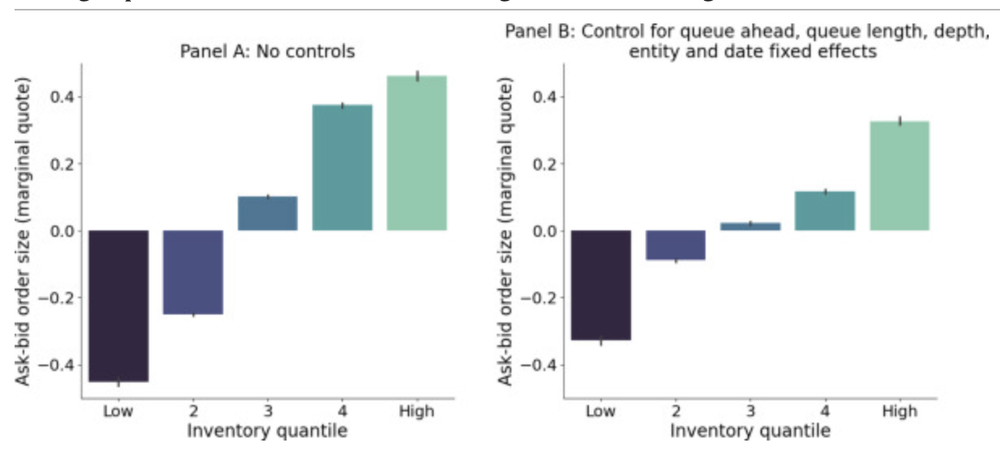

---

##### Download

+ [Paper](https://www.sciencedirect.com/science/article/pii/S1386418125000229)
<!--
+ [Presentation](presentation)
+ [Online appendix](appendix1.pdf)
+ [Code and data](https://github.com/pmichaillat/feru)
-->

---

##### Abstract

Limit order markets use a queuing system in which limit orders must wait in line to execute. We show that the queue position of a limit order influences its adverse selection risk and inhibits inventory risk management. Trade may worsen market maker risk sharing, unlike many protocols without queuing. We uncover a crowding-out effect: An inventory shock reduces liquidity provision by market makers later in the queue. Using futures data, we confirm both low risk sharing and the crowding-out effect. These two results imply a trade-off, as the queuing sequence that optimizes risk sharing decreases quoted depth up to 8.4%.

---

##### Figure 3: Correlation of market maker inventory with queue position



---

##### Citation

Garriott, C., van Kervel, V., & Zoican, M. (2025). Queuing and inventories in limit order markets. *Journal of Financial Markets*, 100982.

```latex
@article{garriott2025queueing,
  title={Queueing and inventories in limit order markets},
  author={Garriott, Corey and van Kervel, Vincent and Zoican, Marius},
  journal={Journal of Financial Markets},
  volume={75},
  pages={100982},
  year={2025},
  publisher={Elsevier}
}
```

---

<!--
##### Related material

+ [Presentation slides](presentation1.pdf)
+ [Summary of the paper](https://www.penguinrandomhouse.com/books/110403/unusual-uses-for-olive-oil-by-alexander-mccall-smith/)
-->
