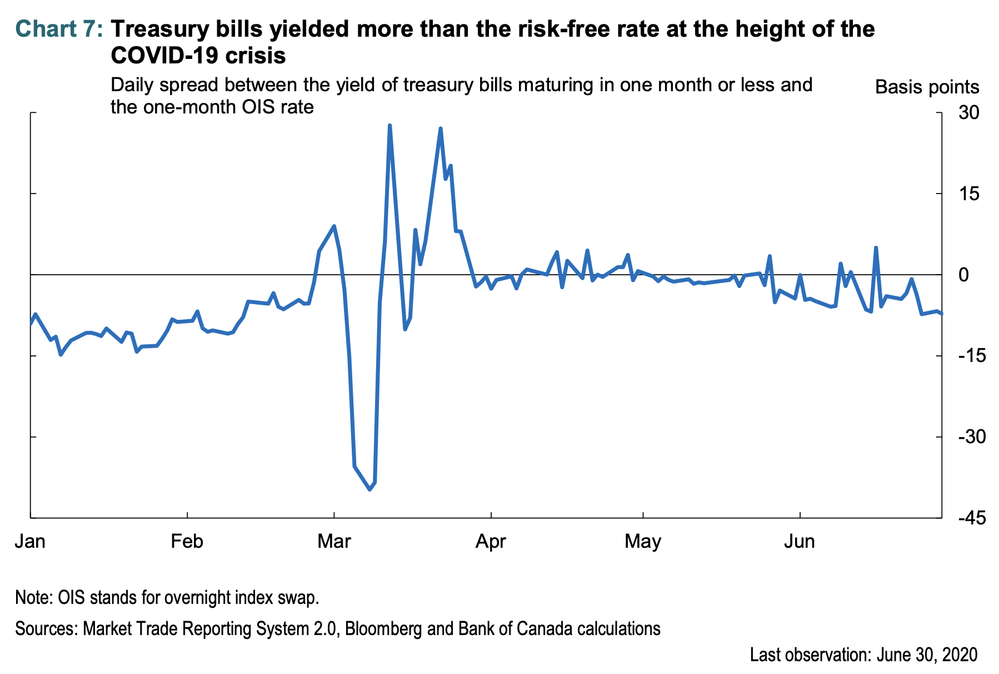

---

##### Download

+ [Paper](https://www.bankofcanada.ca/2021/02/staff-discussion-paper-2021-2/)
<!--
+ [Presentation](presentation)
+ [Online appendix](appendix1.pdf)
+ [Code and data](https://github.com/pmichaillat/feru)
-->

---

##### Abstract

The COVID-19 pandemic has had far-reaching consequences in Canada. As whole industries temporarily shut down, businesses and households suffered income losses and sought loans to survive. Anticipating or facing large demands for money from their investors or counterparties, asset managers needed to sell securities to raise funds. Commercial banks typically serve these needs in their dual role of lender on main street and securities dealer in financial markets.

However, the magnitude of the demand for money during the crisis exceeded the resources bank dealers allocated to dealing on fixed-income markets. The result—the increased scarcity of money in core funding markets—made it challenging for investors to easily sell their fixed-income assets. The Bank of Canada intervened in financial markets on an unprecedented scale.

The experience raises natural policy questions which, if addressed, may help us better weather the next crisis and reduce the need for central bank intervention:

- Can central banks’ policies and crisis interventions in financial markets better reflect the growing role that asset managers play in the financial system?
- Can the structure of financial markets be made less reliant on the capacity of banks to supply money?

---

##### Chart 7: Bills sold at a discount to OIS



---

##### Citation

Fontaine, J. S., Garriott, C., Johal, J., Lee, J., & Uthemann, A. (2021). Covid-19 crisis: Lessons learned for future policy research (No. 2021-2). *Bank of Canada Staff Discussion Paper*.

```latex
@techreport{fontaine2021covid,
  title={Covid-19 crisis: Lessons learned for future policy research},
  author={Fontaine, Jean-S{\'e}bastien and Garriott, Corey and Johal, Jesse and Lee, Jessica and Uthemann, Andreas},
  year={2021},
  number={2},
  journal={Bank of Canada Staff Discussion Paper},
  publisher={Bank of Canada}
}
```

---

<!--
##### Related material

+ [Presentation slides](presentation1.pdf)
+ [Summary of the paper](https://www.penguinrandomhouse.com/books/110403/unusual-uses-for-olive-oil-by-alexander-mccall-smith/)
-->
