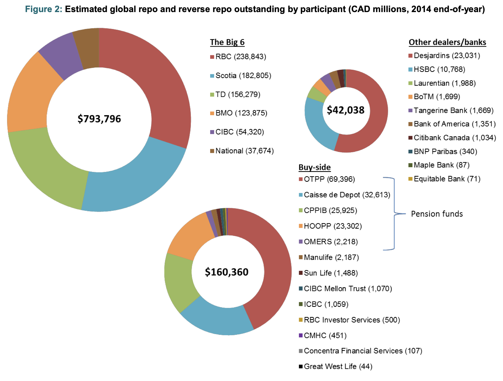

---

##### Download

+ [Paper](https://www.bankofcanada.ca/2016/03/staff-discussion-paper-2016-8/)
<!--
+ [Presentation](presentation)
+ [Online appendix](appendix1.pdf)
+ [Code and data](https://github.com/pmichaillat/feru)
-->

---

##### Abstract

This is the first of the Financial Markets Department’s descriptions of Canadian financial industrial organization. The document discusses the organization of the repurchase-agreement (repo) market in Canada. We define the repo contract, the market infrastructures that support repo trading and the composition of the market participants. We also describe repo trading practices in Canada, risks in the repo market and repo regulation. A repo is a financial contract that resembles a collateralized loan. It is used to support the funding needs of financial institutions and to procure on a temporary basis specific securities. The Canadian repo market is primarily composed of large banks and large investment institutions such as pension funds. A unique feature of the Canadian market is that Canadian investment institutions are net borrowers of cash via repo. Repo can transmit risks in the financial system because it can create levered interconnections among participants. Risks in the Canadian repo market are relatively smaller than in other jurisdictions.

---

##### Figure 2: Repo outstanding at major Canadian financial institutions



This figure got us in a bit of trouble.

---

##### Citation

Garriott, C., & Gray, K. (2016). Canadian repo market ecology (No. 2016-8). *Bank of Canada Staff Discussion Paper*.

```latex
@techreport{garriott2016canadian,
  title={Canadian repo market ecology},
  author={Garriott, Corey and Gray, Kyle},
  year={2016},
  number={8},
  journal={Bank of Canada Staff Discussion Paper},
  publisher={Bank of Canada}
}
```

---

<!--
##### Related material

+ [Presentation slides](presentation1.pdf)
+ [Summary of the paper](https://www.penguinrandomhouse.com/books/110403/unusual-uses-for-olive-oil-by-alexander-mccall-smith/)
-->
