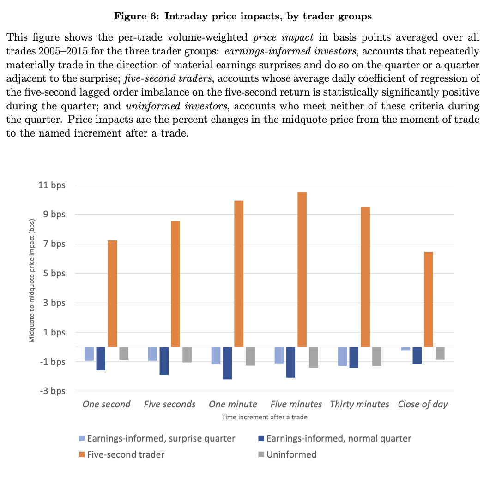

### The traders who move prices don't know much. The traders who know something don't move prices.

A standard assumption in microsructure is that when a trade pushes prices, it's because the trader has private information. Theory often calls these traders "insiders."

Ryan and I argue the reverse: Most of the trades that move stock prices are not motivated by deep knowledge about a company's value but merely by public information.

Our evidence comes from 11 years of trades with account codes from the Toronto Stock Exchange. Among the accounts, we identify a group that appears to have private information, but it barely leaves a footprint in prices. Instead, a completely different group of traders generates the classic price-impact effects predicted of privately informed trading.

The first, "earnings-informed" group is identified by trading in the direction of future earnings surprises. It racks up over CAD $3 billion in gains over 11 years. These accounts behave exactly like classic privately informed traders. They are patient, directional, prefer limit orders, and time their trades for when noise flow is high. But their trades have negative or insignificant short‑run price impact and negative Kyle’s Lambda.

A second group of accounts, “five‑second traders,” is selected because it satisfies the classic prediction of price impact after trades. This group's order flow has reliable, permanent price impact over short and long horizons. Yet these high‑impact traders look more like public‑information traders: mostly aggressive market orders, smaller trades, almost no overlap with the earnings‑informed set, and positions in the wrong direction before big earnings surprises.

The invisible "earnings-informed" accounts appear to have information about the value of stocks, but markets do not appear to be impounding what they know into prices. Instead, price impact mostly reflects the trades of a group that looks like it is using only public information, not the accumulation of private knowledge that textbooks assume drives prices toward fundamentals. This is a troubling result for price discovery and could imply that markets could be much more efficient than they are.

---

##### Download

+ [Paper](https://papers.ssrn.com/sol3/papers.cfm?abstract_id=4866008)
<!--
+ [Presentation](presentation)
+ [Online appendix](appendix1.pdf)
+ [Code and data](https://github.com/pmichaillat/feru)
-->

---

##### Abstract

We empirically identify a group of stock-exchange accounts that profit from 11 years of earnings surprises. Their trading behavior is consistent with privately informed trading, yet they have negative and temporary price impacts. We then empirically identify a second group of accounts that have positive and permanent price impacts. The trading behavior of the second group is more consistent with trading on public information, and they trade the wrong way before earnings surprises. The behavior of both account groups contrasts with models that associate permanent price impact with privately informed trading.

---

##### Figure 6: Price impacts by account grouping and by time period after the trade



---

##### Citation

Garriott, C. & Riordan, R. (2026). The price impacts of informed investors. *Journal of Financial Markets*, XXXXXX.

```latex
@article{garriott2026price,
  title={The price impacts of informed investors},
  author={Garriott, Corey and Riordan, Ryan},
  journal={Journal of Financial Markets},
  volume={XX},
  pages={XXXXXX},
  year={2026},
  publisher={Elsevier}
}
```

---

<!--
##### Related material

+ [Presentation slides](presentation1.pdf)
+ [Summary of the paper](https://www.penguinrandomhouse.com/books/110403/unusual-uses-for-olive-oil-by-alexander-mccall-smith/)
-->
