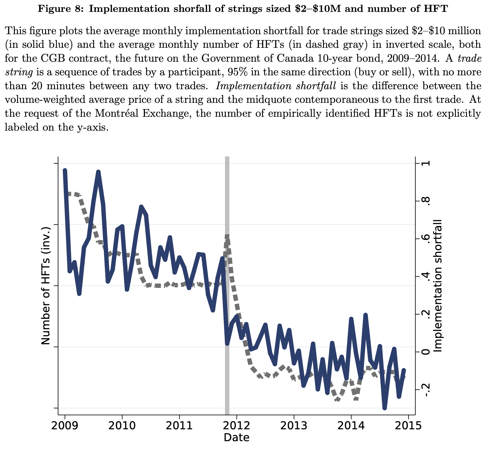

---

### HFT doesn't just compress spreads. It also helps with the bigger orders.

This paper studies HFT activity in Government of Canada 10‑year bond futures (CGB) on the Montréal Exchange from 2009-2015. HFTs are empirically identified by three behaviors: near‑zero overnight inventory, frequent switching between buy and sell, and very short average order lifetimes (under one minute). Large institutional orders are reconstructed as “trade strings”: sequences of same‑direction trades by one participant, at least CAD 2 million in size, with no more than a 20‑minute gap between trades.

When institutions build large positions, HFTs are heavily involved but systematically take the other side: they are short when institutions are net buyers and long when institutions are net sellers. This is the opposite of “back running,” a predatory trading strategy in which a predator builds a position in the same direction as an institution and then unwinds the position at worse prices.
The rejection of back running holds across trade strings binned by size, duration, and long‑run price impact—including the biggest, slowest, most price‑impactful strings that likely reflect informed institutional trading.

---

##### Download

+ [Paper](https://www.sciencedirect.com/science/article/abs/pii/S0927539819301069)
<!--
+ [Presentation](presentation)
+ [Online appendix](appendix1.pdf)
+ [Code and data](https://github.com/pmichaillat/feru)
-->

---

##### Abstract

Using data on Canadian bond futures, we examine how high-frequency traders (HFTs) interact with institutions building large positions. In contrast to recent findings, we find HFTs in the data act as small-sized liquidity suppliers, and we reject the hypothesis that they engage in back running, a predatory trading strategy. Using a quasi-experiment in November 2011, in which a number of HFTs started trading the bond future, we run a difference-in-differences event study and find more competition among HFTs improves implementation shortfall, effective spreads, and short-term price impacts for institutional trading in Canadian bond futures.

---

##### Figure 8: Implementation shortfall before and after the entry of several HFTs in Canadian bond futures



---

##### Citation

Chen, M., & Garriott, C. (2020). High-frequency trading and institutional trading costs. Journal of Empirical Finance, 56, 74-93.

```latex
@article{chen2020high,
  title={High-frequency trading and institutional trading costs},
  author={Chen, Marie and Garriott, Corey},
  journal={Journal of Empirical Finance},
  volume={56},
  pages={74--93},
  year={2020},
  publisher={Elsevier}
}
```

---

<!--
##### Related material

+ [Presentation slides](presentation1.pdf)
+ [Summary of the paper](https://www.penguinrandomhouse.com/books/110403/unusual-uses-for-olive-oil-by-alexander-mccall-smith/)
-->
