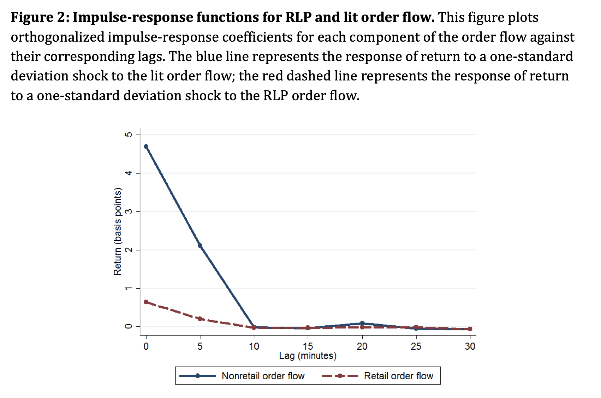

##### Download

+ [Paper](https://www.bankofcanada.ca/2016/04/staff-working-paper-2016-20/)
<!--
+ [Presentation](presentation)
+ [Online appendix](appendix1.pdf)
+ [Code and data](https://github.com/pmichaillat/feru)
-->

---

##### Abstract

In August 2012, the New York Stock Exchange launched the Retail Liquidity Program
(RLP), a trading facility that enables participating organizations to quote dark limit orders
executable only by retail traders. A Hasbrouck (1991) structural vector autoregression
shows that the facility increased the information content of the order flow by
distinguishing retail trades from relatively more informed trades. A differences-in-
differences event study finds that the RLP launch impacted market quality. Stocks with
substantial RLP activity experienced mildly improved relative bid-ask spreads, effective
spreads, price impacts and return autocorrelations in both the RLP and non-RLP
segments.

---

##### Figure 2: The low price impact of retail trades on NYSE's RLP compared to the main order flow



---

##### Citation

Garriott, C., & Walton, A. (2018). Retail order flow segmentation. *The Journal of Trading*, 13(3), 13–23.

```latex
@article{garriott2018retail,
  title={Retail order flow segmentation},
  author={Garriott, Corey and Walton, Adrian},
  journal={The Journal of Trading},
  volume={13},
  number={3},
  pages={13--23},
  year={2018},
  doi={10.3905/jot.2018.13.3.013}
}
```

---

<!--
##### Related material

+ [Presentation slides](presentation1.pdf)
+ [Summary of the paper](https://www.penguinrandomhouse.com/books/110403/unusual-uses-for-olive-oil-by-alexander-mccall-smith/)
-->
